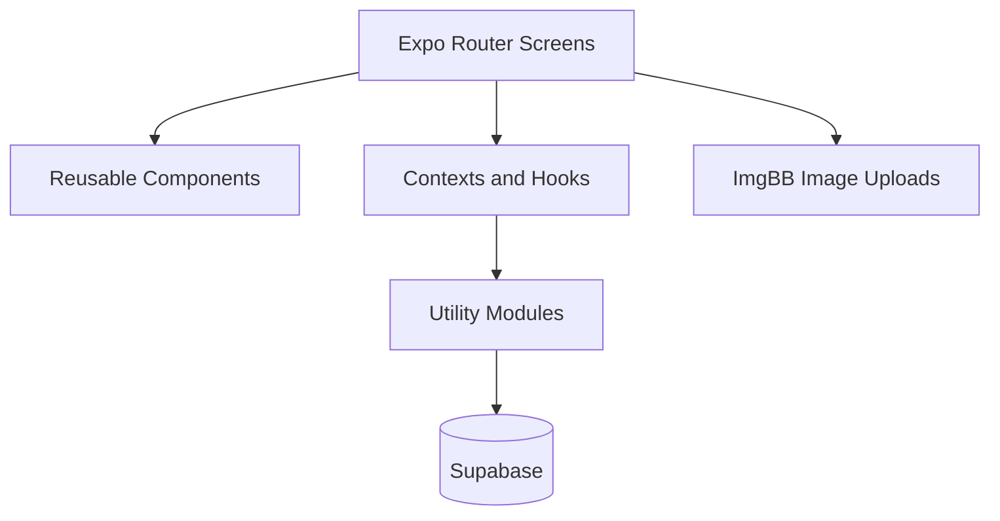

<div align="center">
  
</div>
<h1 align="center">
  QOBuy
</h1>
<p>
  QOBuy is a marketplace listing app that lets users view, upload, edit, track, and search listings, with built-in chat for buyers and sellers to message each other directly.
</p>
<h2 align="center">
  Screenshots
</h2>
<div align="center">
  
  
  
  
  
  
  
</div>
<h2 align="center">
  Installation of the app
</h2>
<ul>
  <li>Open "Releases" tab of this repository </li>
  <li>Download the app by clicking on the .apk file that is in the latest release</li>
  <li>Install the app by opening the downloaded file</li>
</ul>
<h2 align="center">
  Installation of the project to your IDE
</h2>
<ul>
  <li>Make sure that you have Node.js on your machine</li>
  <li>Locate to the folder that you want to install the project files</li>
  <li>Enter these commands to the terminal</li>
  <li>Make sure that you defined your API keys for <a href="https://supabase.com/">Supabase</a> and <a href="https://ru.imgbb.com/">IMGBB</a> in the .env.local file</li>
</ul>
<pre><code>
  git clone https://github.com/mxx567/QOBuy
  cd QOBuy
  npm install
  npx expo start //if you want to test the app with Expo GO
</code></pre>

## Project Structure

QOBuy is an Expo Router marketplace app built with React Native and Supabase.

```text
QOBuy/
├── app.json                    # Expo application configuration.
├── eas.json                    # EAS build profile configuration.
├── package.json                # Dependencies and npm scripts.
├── tsconfig.json               # TypeScript configuration.
├── src/
│   ├── app/                    # Expo Router screens and navigation layouts.
│   │   ├── _layout.tsx         # Configures providers and protected routes.
│   │   ├── loading.tsx         # Displays the startup loading indicator.
│   │   ├── login.tsx           # Allows users to sign in.
│   │   ├── signup.tsx          # Allows users to create an account.
│   │   ├── (main)/             # Contains authenticated tab navigation.
│   │   ├── add/                # Contains listing creation screens.
│   │   ├── edit/               # Contains listing editing screens.
│   │   ├── categories/         # Contains category selection screens.
│   │   ├── regions/            # Contains geographic region selection screens.
│   │   ├── search/             # Contains search filters and results screens.
│   │   ├── listings/           # Contains individual listing detail screens.
│   │   ├── mylistings/         # Contains the user's editable listings screen.
│   │   └── chats/              # Contains chat conversation screens.
│   │
│   ├── components/             # Reusable React Native UI components.
│   │   ├── common/             # Shared buttons, inputs, cards, and headers.
│   │   ├── chat/               # Chat-specific UI components.
│   │   └── img/                # Image selection UI components.
│   │
│   ├── hooks/                  # Shared contexts and custom React hooks.
│   │   ├── AuthContext.tsx     # Exposes authentication state.
│   │   ├── ListingDescriptionContext.tsx # Shares listing form selections.
│   │   └── useFavorites.ts     # Manages a user's favorite listings.
│   │
│   ├── providers/              # Application-wide context providers.
│   │   └── AuthProvider.tsx    # Maintains the Supabase user session.
│   │
│   ├── utils/                  # App-local helper functions.
│   │   └── listingValidation.ts # Validates listing form fields.
│   │
│   └── assets/                 # Mobile app fonts, icons, and images.
│
├── utils/                      # Shared data and service utilities.
│   ├── supabase.ts             # Creates the Supabase client.
│   ├── imgbb.ts                # Uploads listing images to ImgBB.
│   ├── categoryManager.ts      # Fetches categories and subcategories.
│   ├── regionManager.ts        # Fetches and organizes regions.
│   ├── favorites.ts            # Reads and updates saved listings.
│   └── date2string.ts          # Formats dates for display.
│
├── constants/                  # Shared application constants.
├── .expo/                      # Expo-generated local development files.
├── dist/                       # Generated web build output.
└── node_modules/               # Installed npm dependencies.
```

### Main Screens

| Folder or file | Purpose |
| --- | --- |
| `src/app/(main)/(tabs)/index.tsx` | Displays the newest marketplace listings. |
| `src/app/(main)/(tabs)/favorites.tsx` | Displays the user's favorite listings. |
| `src/app/(main)/(tabs)/messages.tsx` | Displays the user's chat list. |
| `src/app/add/index.tsx` | Creates a new listing and optionally uploads images. |
| `src/app/edit/index.tsx` | Updates or removes an existing listing. |
| `src/app/listings/[listing].tsx` | Displays a listing's details, images, owner, and actions. |
| `src/app/search/index.tsx` | Collects listing search filters. |
| `src/app/search/searchresults/index.tsx` | Displays paginated filtered search results. |
| `src/app/chats/[chat].tsx` | Displays and sends messages in a conversation. |
| `src/app/mylistings/index.tsx` | Displays listings owned by the current user. |

### Shared Components

| Folder | Purpose |
| --- | --- |
| `src/components/common/` | Contains shared buttons, inputs, headers, listing cards, and navigation UI. |
| `src/components/chat/` | Contains chat messages, headers, and message composer controls. |
| `src/components/img/` | Contains image-picker controls used by listing forms. |

### Data Flow



